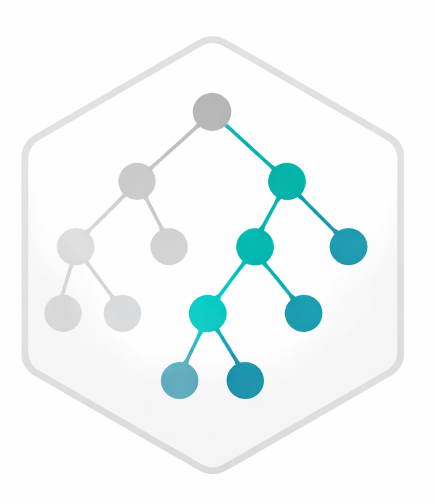

[](https://github.com/Thomas-Rauter/GOcontext/actions/workflows/R-CMD-check.yaml?query=branch%3Amain)
[](https://codecov.io/gh/Thomas-Rauter/GOcontext)
[](LICENSE)


<div style="display: flex; align-items: flex-start; gap: 20px;">



<div>

Context-aware restriction of the Gene Ontology (GO) hypothesis space for
enrichment analysis.

</div>
</div>

`GOcontext` constructs **context-specific GO subgraphs** to restrict the set of
GO terms tested in enrichment analysis. Starting from the Gene Ontology graph
distributed in `GO.db`, organism-specific GO-to-gene mappings can be attached
from an `OrgDb`, and the ontology can then be restricted to terms relevant to
the current biological context.

By reducing the number of tested GO terms while preserving the underlying GO
graph structure, `GOcontext` aims to decrease the multiple testing burden while
maintaining a transparent and reproducible GO universe for enrichment
analysis.

See the full documentation at the
[GOcontext website](https://thomas-rauter.github.io/GOcontext/).


## Installation

<!-- ### Bioconductor -->

<!-- ```{r install from Bioconductor, eval = TRUE} -->
<!-- if (!requireNamespace("BiocManager", quietly = TRUE)) { -->
<!--   install.packages("BiocManager") -->
<!-- } -->
<!-- BiocManager::install("GOcontext") -->
<!-- ``` -->

```{r install from GitHub, eval = FALSE}
if (!requireNamespace("remotes", quietly = TRUE)) {
  install.packages("remotes")
}

remotes::install_github(
  "Thomas-Rauter/GOcontext",   # GitHub repository
  ref = "<tag>",        # Version to install, e.g. v0.1.0 
  dependencies = TRUE,  # Install all dependencies
  upgrade = "always"    
)
```


## Issues

Bug reports and feature requests are welcome via GitHub Issues.


## License

MIT

